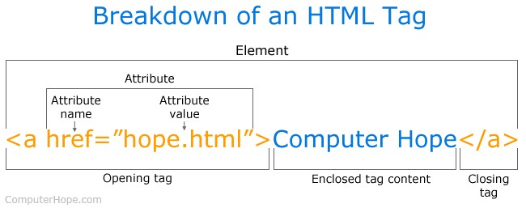
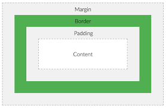

# KSM PBW

## Persiapan Tools

Untuk mempermudah proses ngoding sangat disarankan untuk menggunakan Code Editor, sangat direkomendasikan untuk menggunakan [Visual Studio Code](https://code.visualstudio.com/). Setalah download dan menginstallnya, berikut beberapa extension yang cukup membantu untuk ngoding

1. **Beutify**, untuk merapikan code secara otomatis
2. **indent-rainbow**, memberikan warna pada identasi
3. **Mithrill Emmet**, memberikan shortcut untuk membuat tag html
4. **open in browser**
5. **Live Server**
6. **Bracket Pair Colorizer**
7. **IntelliSense for CSS**
8. **Material Theme**

## Materi HTML

Struktur Dasar dari Tag HTML

1. [Validator HTML](https://validator.w3.org/)
2. [HTML Element Reference](https://www.w3schools.com/tags/ref_byfunc.asp)
3. [HTML Global Attributes](https://www.w3schools.com/tags/ref_standardattributes.asp)
4. [HTML Attribute Reference](https://www.w3schools.com/tags/ref_attributes.asp)
5. [HTML Block and Inline Elements](https://www.w3schools.com/html/html_blocks.asp)
6. [Video HTML Dasar](https://www.youtube.com/playlist?list=PLFIM0718LjIVuONHysfOK0ZtiqUWvrx4F)

## Materi CSS

Struktur dari CSS

Box Model

1. [CSS Selector Reference](https://www.w3schools.com/cssref/css_selectors.asp)
2. [CSS Properties](https://www.w3schools.com/cssref/default.asp)
3. [CSS Specificity](https://www.w3schools.com/css/css_specificity.asp)
4. [Video CSS Dasar](https://www.youtube.com/playlist?list=PLFIM0718LjIUBrbm6Gdh6k7ZUvPIAZm7p)
5. [Video CSS Layouting](https://www.youtube.com/playlist?list=PLFIM0718LjIUu4Ju9GUL5zpLcuq08TKYr)
6. [Video CSS Flexbox](https://www.youtube.com/playlist?list=PLFIM0718LjIU1lWlM34j6E9fMlrrSGZ1k)
7. [Video CSS Grid](https://www.youtube.com/playlist?list=PLFIM0718LjIXmbwX0dEsoRVX-PC16vmuw)
8. [CSS Attribute Selectors](https://www.w3schools.com/css/css_attribute_selectors.asp)

## Materi JavaScript

1. [JavaScript Math Object](https://www.w3schools.com/js/js_math.asp)
2. [JavaScript HTML DOM](https://www.w3schools.com/js/js_htmldom.asp)
3. [HTML DOM Events](https://www.w3schools.com/jsref/dom_obj_event.asp)
4. [Video Javascript Dasar](https://www.youtube.com/playlist?list=PLFIM0718LjIWXagluzROrA-iBY9eeUt4w)
5. [Video DOM](https://www.youtube.com/playlist?list=PLFIM0718LjIWB3YRoQbQh82ZewAGtE2-3)
6. [Video JavaScript Lanjutan](https://www.youtube.com/playlist?list=PLFIM0718LjIUGpY8wmE41W7rTJo_3Y46-)
